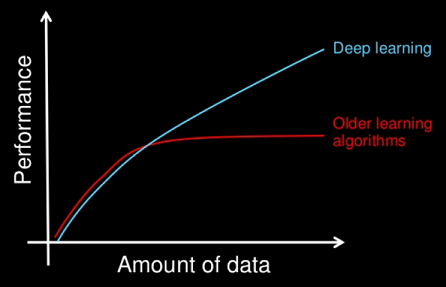
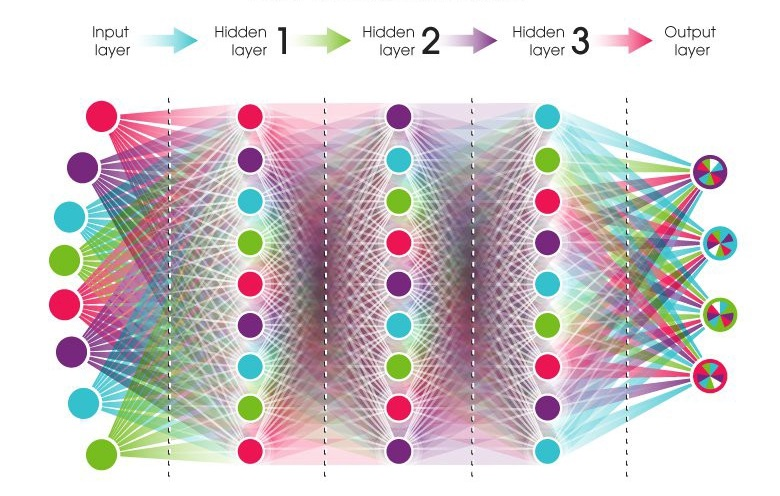

```{r setup, include=FALSE}
options(htmltools.dir.version = FALSE)
```

# Welcome/Introduction

---
# Agenda

- Introduction to Deep Learning

- Hands-on Keras Demo

- Loss Reserving Case Study

- Q+A and Open Discussion

---
# What is Machine Learning?

- A field of computer science that gives computers the ability to "learn" with data, without being explicitly programmed.


---
# Why Deep Learning?

- Subset of machine learning

- Uses a neural network to simulate how the human brain learns

- Performs better than traditional machine learning techniques for large datasets

```{r fig.align='center', out.width='60%', echo=FALSE}

```

---
# What is a Neural Network?



---
# How does a neural network learn?

- Gradient Descent

- Backpropagation


---
# What software is available for deep learning?

- Front-end/programming language

    - R, Python

- Interface between front and back end

    - Keras

- Back-end for calculations

    - TensorFlow, Theano

---
# Intro to Keras

- Keras is a high-level neural networks API developed with a focus on enabling fast experimentation

- https://keras.rstudio.com/

---
# MNIST Example

Switch to R here

---
# Loss Reserving Case Study

Kevin's slides

---
# Q&A and Discussion

---
