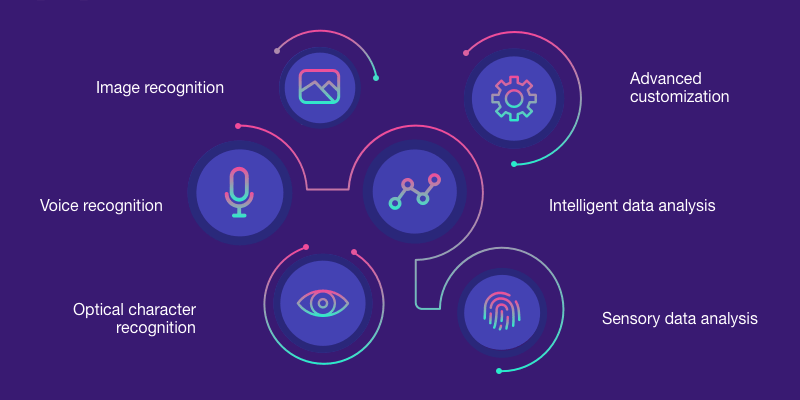
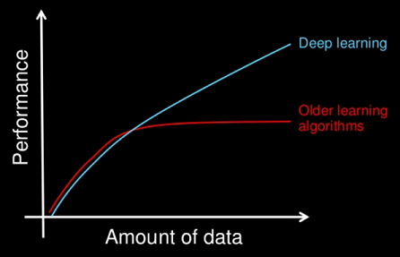
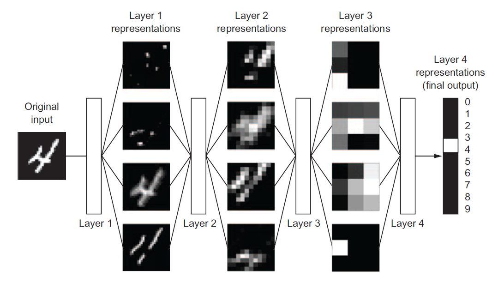
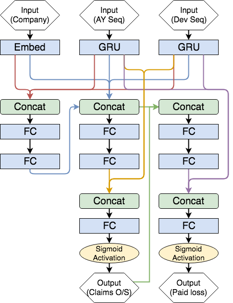
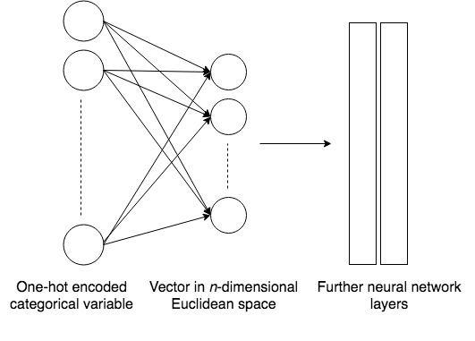
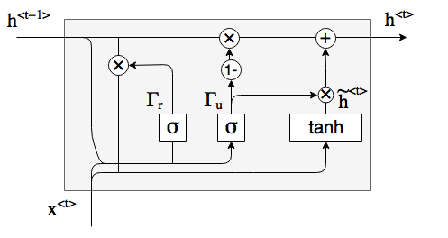
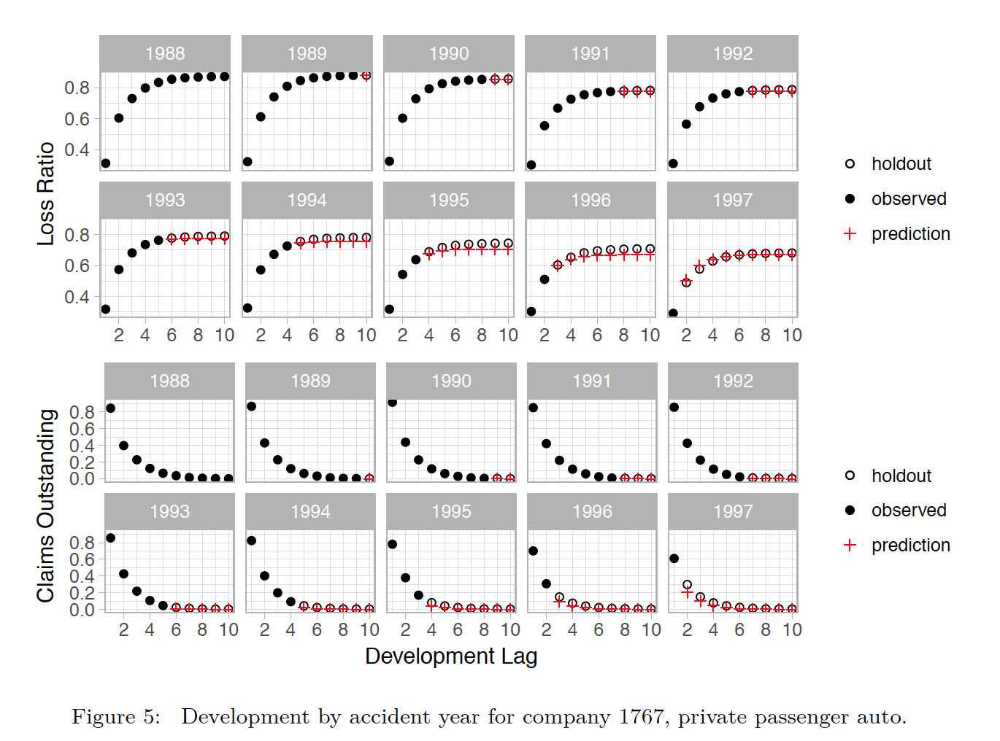
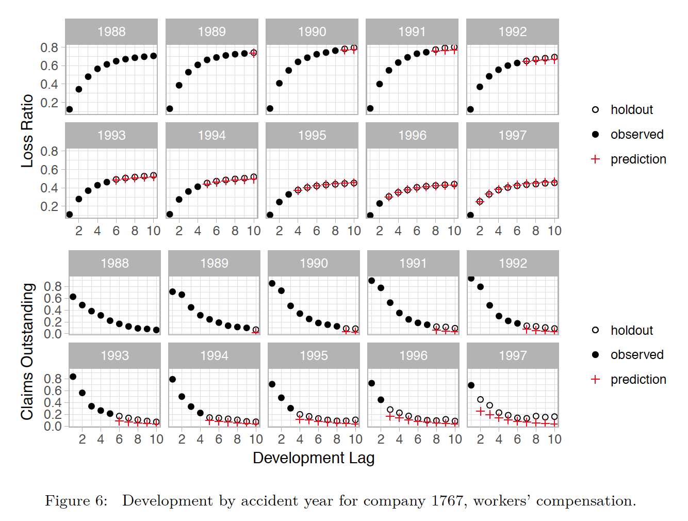
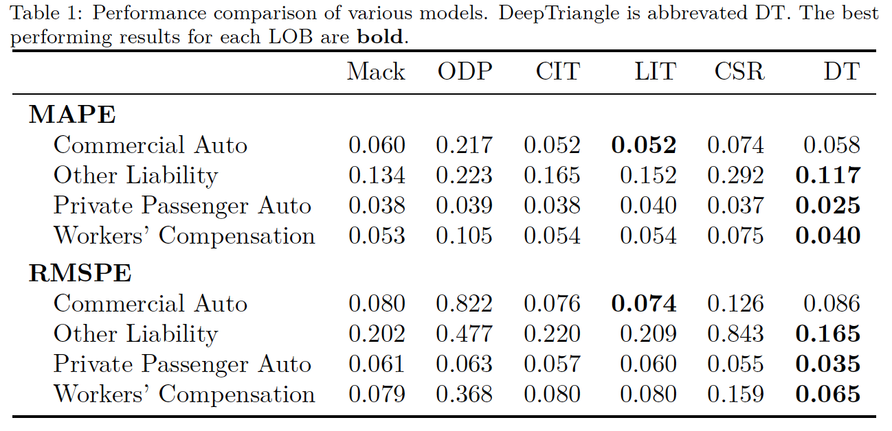

```{r setup, include=FALSE}
options(htmltools.dir.version = FALSE)
```

# Agenda

- Introduction to Deep Learning

- Loss Reserving Case Study

- Q+A

---
# What is Machine Learning?

.full-width[.content-box-blue[A field of computer science that gives computers the ability to "learn" with data, without being explicitly programmed]]



---
# Why Deep Learning?

- Subset of machine learning

- Often uses a neural network to simulate how the human brain learns

- Performs better than traditional machine learning techniques for large datasets

```{r fig.align='center', out.width='60%', echo=FALSE}

```

---
# What is a Neural Network?



---
# How does a neural network learn?

- Loss Functions

- Gradient Descent

- Backpropagation


---
# Intro to Keras

.full-width[.content-box-red[Keras<sup>*</sup> is a high-level neural networks API developed with a focus on enabling fast experimentation]]

.footnote[[*] [https://keras.rstudio.com/](https://keras.rstudio.com/)]

---
class: inverse, center, middle

# Loss reserving case study

---
# Example triangle

```{r, message = FALSE, echo = FALSE}
library(tidyverse)
data <- insurance::schedule_p %>% 
  filter(lob == "private_passenger_auto", 
         calendar_year < 1994,
         group_code == "43") %>%
  select(accident_year, development_lag, incremental_paid_loss)
data %>% 
  spread(development_lag, incremental_paid_loss)
```

---

# Treat this as a predictive modeling problem

Each cell of the triangle is a row in the modeling dataset.

We just need to come up with some predictors.

```{r, echo = FALSE}
data %>%
  mutate(predictors = "?!?!?!?!?!?") %>% 
  head(8)
```

---

# Introducing DeepTriangle

Let's try to apply neural networks on some real reserving data.

<br />

.content-box-yellow[We will call this network **DeepTriangle**<sup>*</sup>.]

.footnote[[*] [GitHub](https://github.com/kevinykuo/deeptriangle)] 

---

# Data

Schedule P data from the [CAS website](http://www.casact.org/research/index.cfm?fa=loss_reserves_data).

.full-width[.content-box-green[10 accident years (1988-1997) of paid and incurred losses, with 10 development lags, from several companies and lines of business.]]

---

# Response and predictors

.full-width[.content-box-purple[Let's talk about our response variable and predictors!]]

---

# Response

- **Response: future incremental paid losses and claims outstanding**

We will predict both paid loss and claims outstanding in the same model.

---

# Predictors

Note that... there's really not much we can use in aggregated data. We also have to follow this rule:

> The information used to derive the predictors for a cell must be available before the calendar period associated with the cell.

---

# Predictors

- Response: future incremental paid losses and claims outstanding
- **Predictors:**
  - **Time series of paid losses and case reserves**

---

# Predictors

For each cell in the triangle, we take the experience for the AY up to the previous calendar year. For example, for AY 1988 we have:

```{r, out.width="100%", echo = FALSE}
sample_data_with_paid_history <- data %>%
  group_by(accident_year) %>%
  mutate(
    paid_history = map_chr(
      development_lag, # for each development year, get paid 
      # loss numbers up to the year before
      ~ incremental_paid_loss[0:(.x - 1)] %>%
        paste0(collapse = ", ") # for printing
    )
  ) %>%
  ungroup() %>%
  filter(accident_year == 1988) %>%
  select(development_lag, incremental_paid_loss, paid_history)

sample_data_with_paid_history
```

---

# Predictors

- Response: incremental paid losses and total claims outstanding 
- **Predictors:**
  - Time series of paid losses and case reserves along accident year 
  - **Company (because we're using data from all companies simultaneously)**

Now that we've gone through the response and predictors, let's talk about the neural network itself!

---

# Architecture

```{r, out.width= "80%", fig.align='center', echo = FALSE}

```

---

# Embedding layer

Dimensionality reduction is the goal of this layer.

```{r, out.width= "60%", fig.align='center', echo = FALSE}

```

For example, company #5 might get mapped to `c(0.4, 1.2, -3.7)`.

---

# Helping RNN remember

A gated recurrent unit (GRU) is an architecture that helps the network remember things from a long time ago.

```{r, out.width= "70%", fig.align='center', echo = FALSE}

```

---

# Some results

Results from a sample commercial auto company:

```{r, out.width= "70%", fig.align='center', echo = FALSE}

```

---

# Some results

Results from a sample workers compensation company:

```{r, out.width= "70%", fig.align='center', echo = FALSE}

```

---

# Benchmarking

Results for other methods except for ML taken from the [Meyers monograph](http://www.casact.org/pubs/monographs/index.cfm?fa=meyers-monograph01) on stochastic loss reserving.

```{r, out.width= "70%", fig.align='center', echo = FALSE}

```

---

# Conclusion

- Neural networks perform well when performing basic loss reserving

- Many possible model architectures, which could have other actuarial applications

---

# Future work

- Claim level analytics, where we can take into account things like adjusters' notes and images

- Policy level analytics, towards a holistic approach to pricing + reserving

- Improving interpretability of models

---

# Kasa AI

- New initiative that encourages innovation in insurance analytics

- Focus on collaboration and an open source environment

- If interested, visit [kasa.ai](https://kasa.ai/)

---

# Questions?

Slides can be found at [https://case-deep-learning.netlify.com](https://case-deep-learning.netlify.com)

