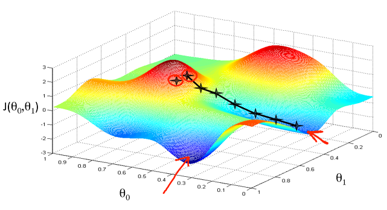
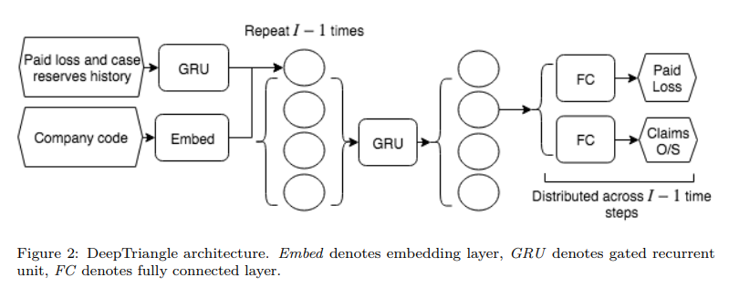
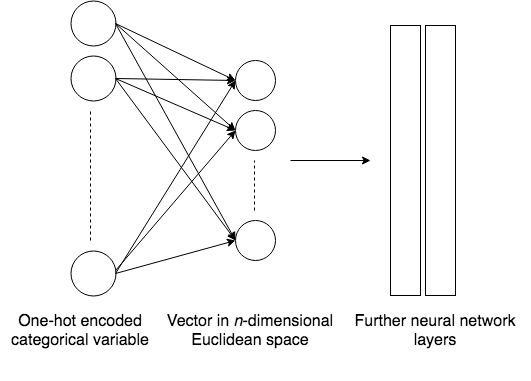
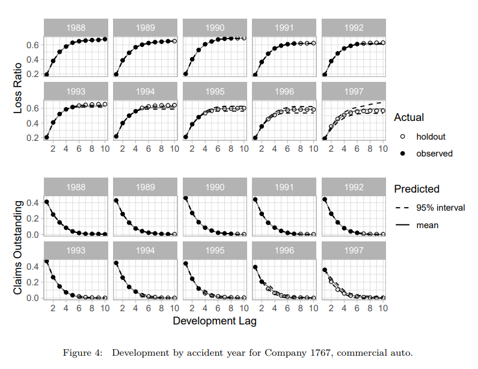
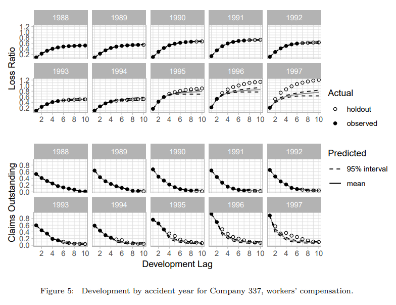
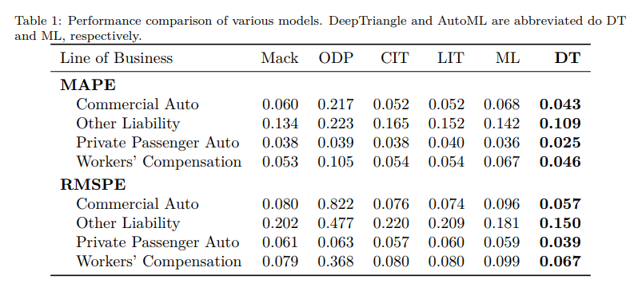
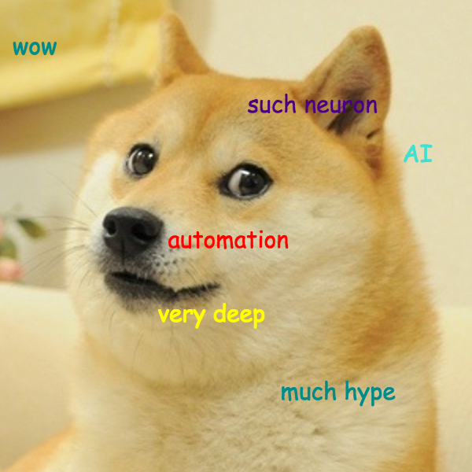
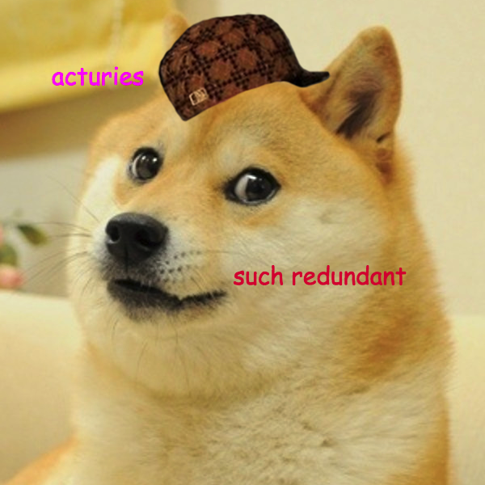
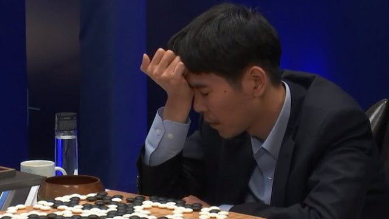

```{r setup, include=FALSE}
options(htmltools.dir.version = FALSE)
```

# Introduction

Your hosts and their drinks of choice.

 

.content-box-gray[Can you spot the actuary?]

---
# Agenda

- Introduction to Deep Learning

- Hands-on Keras Demo

- Loss Reserving Case Study

- Q+A and Open Discussion

---
# What is Machine Learning?

- A field of computer science that gives computers the ability to "learn" with data, without being explicitly programmed


---
# Why Deep Learning?

- Subset of machine learning

- Often uses a neural network to simulate how the human brain learns

- Performs better than traditional machine learning techniques for large datasets

```{r fig.align='center', out.width='60%', echo=FALSE}
knitr::include_graphics("figs/deep-learning.png")
```

---
# What is a Neural Network?


---
# How does a neural network learn?

- Loss Functions

- Gradient Descent



---
# What software is available for deep learning?

- Front-end/programming language

    - R, Python

- Interface between front and back end

    - Keras

- Back-end for calculations

    - TensorFlow, Theano

---
# Intro to Keras

- Keras is a high-level neural networks API developed with a focus on enabling fast experimentation

- https://keras.rstudio.com/

---
# MNIST Example


---
class: inverse, center, middle

# Loss reserving case study

---

# "Claims liabilities Estimation"

.content-box-blue[Basically, figure out what we gotta pay in the future due to claims.]

---

# Example triangle

```{r, message = FALSE, echo = FALSE}
library(tidyverse)
data <- insurance::schedule_p %>% 
  filter(lob == "private_passenger_auto", 
         calendar_year < 1994,
         group_code == "43") %>%
  select(accident_year, development_lag, incremental_paid_loss)
data %>% 
  spread(development_lag, incremental_paid_loss)
```

---

# Treat this as a predictive modeling problem

Each cell of the triangle is a row in the modeling dataset.

We just need to come up with some predictors

```{r, echo = FALSE}
data %>%
  mutate(predictors = "?!?!?!?!?!?") %>% 
  head(8)
```

Then we can do something like

```{r, eval = FALSE}
crazy_AI_algorithm(incremental_paid_loss ~ predictors, data = data)
```

---

# Introducing DeepTriangle

Let's try to apply neural networks on some real reserving data.

<br />

.content-box-yellow[We're gonna call it **DeepTriangle**<sup>*</sup> because it sounds cool.]

.footnote[[*] [https://arxiv.org/abs/1804.09253](https://arxiv.org/abs/1804.09253)] 

---

# Data

Schedule P data from [http://www.casact.org/research/index.cfm?fa=loss_reserves_data](http://www.casact.org/research/index.cfm?fa=loss_reserves_data).

.full-width[.content-box-green[10 accident years (1988-1997) of paid and incurred losses, with 10 development lags, from a bunch of companies and lines of business.]]

---

# Response and predictors

.content-box-purple[Let's talk about our response variable and predictors!]

---

# Response

- **Response: incremental paid losses and total claims outstanding**

We're gonna predict both paid loss and claims o/s in the same model, ain't that cool?!

---

# Predictors

- Response: incremental paid losses and total claims outstanding `r emo::ji("thumbsup")`
- **Predictors:**

---

# Predictors

Note that... there's really not much we can use in aggregated data. We also have to follow this rule:

> The information used to derive the predictors for a cell must be available before the calendar period associated with the cell.

I.e. we're not cheating and looking into the future.

---

# Predictors

- Response: incremental paid losses and total claims outstanding `r emo::ji("thumbsup")`
- **Predictors:**
  - **Time series of paid losses and case reserves**

---

# Predictors

Let's see what we mean by "time series of paid losses".

---

# Predictors

Basically, for each cell in the triangle, we take the experience for the AY up to the previous calendar year. For example, for AY 1988 we have:

```{r, out.width="100%", echo = FALSE}
sample_data_with_paid_history <- data %>%
  group_by(accident_year) %>%
  mutate(
    paid_history = map_chr(
      development_lag, # for each development year, get paid 
      # loss numbers up to the year before
      ~ incremental_paid_loss[0:(.x - 1)] %>%
        paste0(collapse = ", ") # for printing
    )
  ) %>%
  ungroup() %>%
  filter(accident_year == 1988) %>%
  select(development_lag, incremental_paid_loss, paid_history)

sample_data_with_paid_history
```

---

# Predictors

- Response: incremental paid losses and total claims outstanding `r emo::ji("thumbsup")`
- **Predictors:**
  - Time series of paid losses and case reserves `r emo::ji("thumbsup")`
  - **Company (because we're using data from all companies simultaneously)**

---

# Predictors

Company code is one-hot encoded, e.g. the third company in a collection of $20$ companies would be represented as

```{r, echo = FALSE}
c(0, 0, 1, rep(0, 17))
```

Super easy!

---

# Predictors

- Response: incremental paid losses and total claims outstanding `r emo::ji("thumbsup")`
- Predictors:
  - Time series of paid losses and case reserves along accident year `r emo::ji("thumbsup")`
  - Company (because we're using data from all companies simultaneously) `r emo::ji("thumbsup")`

Now that we've gone through the response and predictors, let's talk about the neural network itself!

---

# Architecture

Looks fancy, but it's just a neural network!

```{r, out.width= "30%", fig.align='center', echo = FALSE}

```

---

# Embedding layer

Dimensionality reduction!

```{r, out.width= "60%", fig.align='center', echo = FALSE}

```

For example, company #5 might get mapped to `c(0.4, 1.2, -3.7)`.

---

# Neural network for sequences

Just like a vanilla feedforward neural network, except we feed the sequential input... in sequence.

```{r, out.width= "70%", fig.align='center', echo = FALSE}
knitr::include_graphics("figs/rnn.png")
```

---

# Helping RNN remember

**(Don't worry about the details!)**

Gated recurrent unit (GRU) is an architecture that helps the network remember stuff from a long time ago.

```{r, out.width= "70%", fig.align='center', echo = FALSE}
knitr::include_graphics("figs/gru.png")
```

---

# Putting it all together

Again, we're really just applying a bunch of functions, one after another, to our input data.

```{r, out.width= "30%", fig.align='center', echo = FALSE}

```

---

# Some results

Sample results from the company with the most data in the dataset...

```{r, out.width= "70%", fig.align='center', echo = FALSE}

```

---

# Some results

Workers' comp

```{r, out.width= "70%", fig.align='center', echo = FALSE}

```

---

# Benchmarking

Results for other methods taken from [http://www.casact.org/pubs/monographs/index.cfm?fa=meyers-monograph01](http://www.casact.org/pubs/monographs/index.cfm?fa=meyers-monograph01).

```{r, out.width= "70%", fig.align='center', echo = FALSE}

```

---

# Discussion

Neural networks aren't too shabby at doing some basic reserving work.

But this is just the beginning!

---

# Discussion

Future work?

- Predictions intervals for reserve variability.

- Claims level analytics, where we can take into account things like adjusters' notes and images.

- Policy level analytics, towards a holistic approach to pricing + reserving.

- Interpretability.

---

# Discussion

Neural networks are cool (again) and you should give it a shot.

```{r, out.width= "60%", fig.align='center', echo = FALSE}

```

---

# Discussion

Don't be scared.

```{r, out.width= "60%", fig.align='center', echo = FALSE}

```

---

# Discussion

Really, we spend years taking all those exams, and exams are hard.

```{r, out.width= "70%", fig.align='center', echo = FALSE}

```

---

# Discussion

Unlike other fields, actuarial work requires tremendous domain expertise.

```{r, out.width= "70%", fig.align='center', echo = FALSE}

```

---

# Discussion

/s

Takeaway?

There's a lot of hype and noise around AI, but stay informed, lest we fall behind!

---

# Q&A

